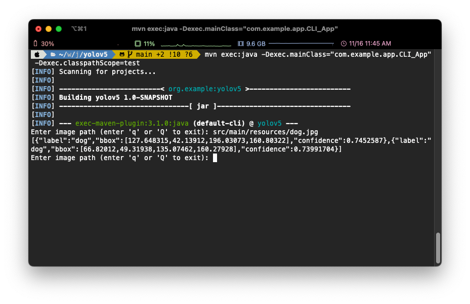

# Onnxruntime Java Example : yolov5

- An object detection example using onnxruntime and YOLO (v5 and v8)


```bash
mvn clean compile

# GUI App
# mvn exec:java -Dexec.mainClass="com.example.app.swing.SwingApp" -Dexec.classpathScope=test

# CLI APP
# mvn exec:java -Dexec.mainClass="com.example.app.cli.CLI_App" -Dexec.classpathScope=test

# API 
mvn spring-boot:run
```

## Configs

- See `src/main/resources/model.properties`

```properties
modelName=yolov5
modelPath=yolov5s.onnx
#modelName=yolov8
#modelPath=yolov8s.onnx
labelPath=coco.names
confThreshold=0.25
nmsThreshold=0.45
gpuDeviceId=-1
```

## GUI Demo


## CLI Demo



## Rest API Demo

- Endpoint: `/detection`
  - `multipart/form-data`
  - `name="uploadFile"`


## Updates

### Feb 25, 2023

- Updated Yolov8 support
- The model configs have been changed to be controlled through the properties file
