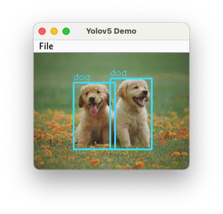

# Onnxruntime Java Example : yolov5


```bash
mvn clean compile

# GUI App
# mvn exec:java -Dexec.mainClass="com.example.app.SwingApp" -Dexec.classpathScope=test

# CLI APP
# mvn exec:java -Dexec.mainClass="com.example.app.CLI_App" -Dexec.classpathScope=test

# API 
mvn spring-boot:run
```

## GUI Demo




## CLI Demo


## Rest API Demo

- Endpoint: `/detection`
  - `multipart/form-data`
  - `name="uploadFile"`

